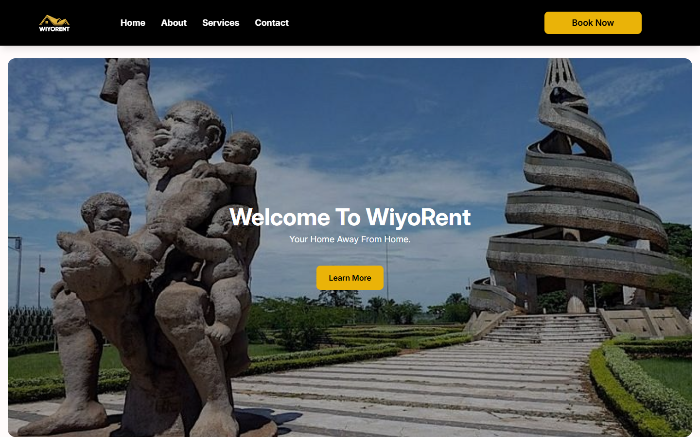
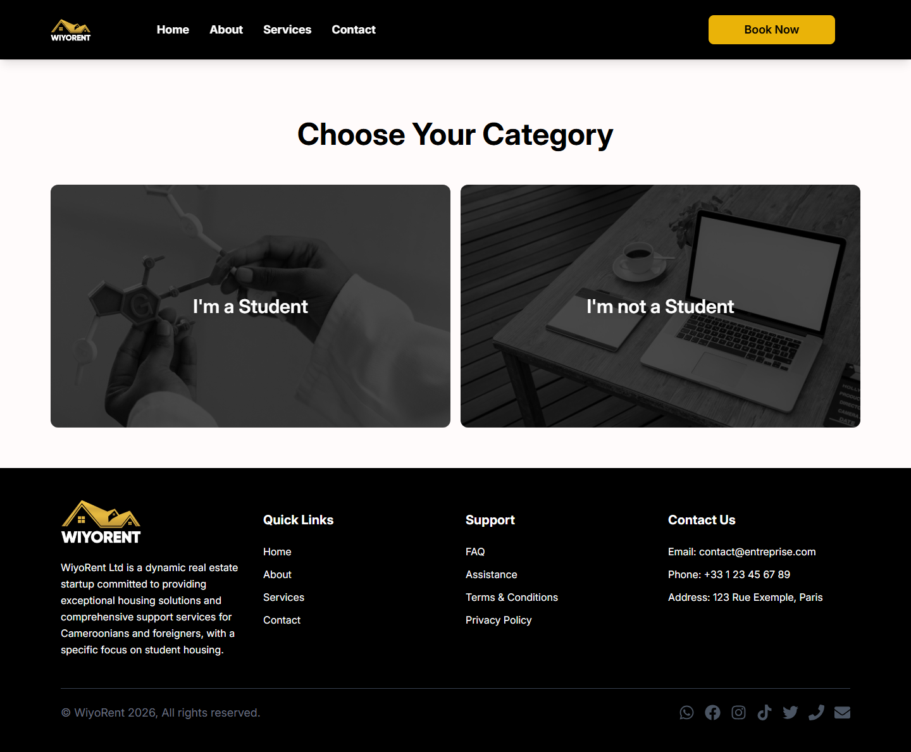

# WiyoRent


Site vitrine de location au Cameroun : logements, voitures, salles et services événementiels, le tout accessible depuis un seul point d'entrée.

## Description

WiyoRent est une application web React présentant différentes catégories de location (appartements, logements étudiants, voitures, salles de cérémonie, services de décoration, traiteur, réservation de restaurant) sous forme de pages dédiées. Chaque catégorie expose une galerie photo et une page de détail, et le visiteur est redirigé vers WhatsApp ou les réseaux sociaux pour la prise de contact.

## Fonctionnalités clés

- Page d'accueil avec carrousel de mise en avant
- Choix de catégorie ("Étudiant" / "Non étudiant") orientant la navigation
- Pages dédiées par type de location : appartements, logements étudiants, maisons, voitures, salles de cérémonie, décoration, traiteur, restaurant
- Galeries photo et page de détail par bien (route `/Details/:type/:id`)
- Section contact avec carte Google Maps intégrée et liens WhatsApp / Facebook / Instagram / TikTok / Twitter / téléphone / email
- Écran de chargement (spinner) et page d'erreur 404 personnalisée
- Routage client avec React Router (rewrites configurés pour Vercel)

## Stack technique

- **React 18** + **Vite 5**
- **React Router 6** pour la navigation
- **Tailwind CSS 3** pour le style
- **Headless UI** / **Heroicons** / **React Icons** pour les composants et icônes UI
- Déploiement sur **Vercel**

## Démo

Démo en ligne : **[wiyorent.vercel.app](https://wiyorent.vercel.app)**

## Captures d'écran

| Accueil | Choix de catégorie |
| --- | --- |
|  |  |

## Installation et lancement local

```bash
# Cloner le dépôt
git clone https://github.com/nagoloumdaniel/wiyorent.git
cd wiyorent

# Installer les dépendances
npm install

# Lancer le serveur de développement (Vite)
npm run dev

# Build de production
npm run build

# Prévisualiser le build de production
npm run preview
```

## Auteur

**Daniel Nagoloum Talla**
[GitHub](https://github.com/nagoloumdaniel) · [Portfolio](https://nagoloum.vercel.app)
